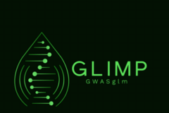

# Glimp: GWAS Analysis Package

**Glimp** is an R package designed for **Genome-Wide Association Studies (GWAS)** using a **Generalized Linear Model (GLM)**. It integrates **Principal Component Analysis (PCA)** to account for population structure and includes visualization tools such as **Manhattan plots** and **QQ plots** to assess GWAS results.

---

## 📌 **Installation**
You can install `Glimp` from GitHub using the following commands:

```r
install.packages("devtools")  # Install devtools if not installed
library(devtools)
install_github("NosheenFatima/Glimp")
